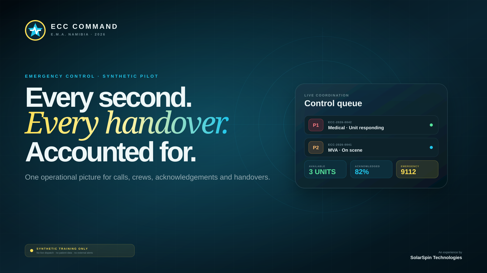
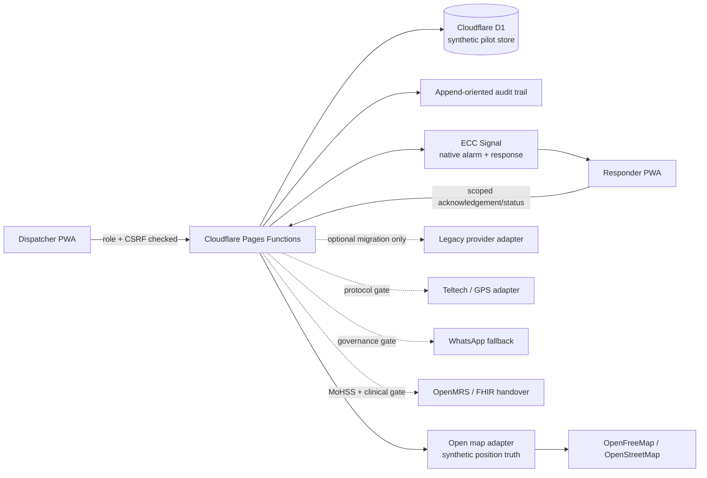

# ECC Command · E.M.A. Namibia

An emergency coordination concept for E.M.A. Namibia—designed around the people already doing the work, the language they already use, and the operational truth they need in the next second.

[Open the protected pilot](https://ecc-command.pages.dev/) · [E.M.A. Namibia](https://ema-namibia.pages.dev/) · [SolarSpin Technologies](https://freeman-ipumbu.pages.dev/)

> The public repository is a sanitised product case study. The production source, credentials, operational configuration and supplied documents remain private.

## The brief

E.M.A. needed more than another website. Its emergency control workflow spans calls, radio, responders, ambulance availability, location uncertainty, alarm acknowledgement, case reports and eventual links to sponsored Teltech radios and other approved services.

The pilot turns that fragmented operating picture into one coherent system:

- a dispatcher command centre
- a guided, workbook-aligned intake
- a source-labelled open operational map for Windhoek and Walvis Bay
- **ECC Signal**, an E.M.A.-owned alarm and acknowledgement engine with no paid provider on the critical path
- a responder PWA with alarm acknowledgement and status controls
- a five-step first-run tour and printable field guide
- a public companion experience for 9112, location preparation and community information
- an integration boundary that keeps E.M.A. in control of its own record

## Product principles

### Human command, computational support

The interface can surface missing answers, explicit danger signals and plausible locations. A human dispatcher still confirms the location, priority, alarm text and assignment. The pilot does not diagnose, autonomously dispatch, silently downgrade or refuse help.

### Uncertainty is visible

Unknown hospital capacity stays **unknown**. Stale GPS stays **stale**. Unacknowledged alarms stay visible. A suggestion is never disguised as a fact.

### One case, one owner, one trail

Cases show an accountable owner. Protected actions create timestamped server-side audit events. Status 0—medic distress—is deliberate, conspicuous and designed for an approved escalation path.

### Built for nonprofit reality

The architecture favours an installable web app, low-bandwidth operation, open adapters and a staged migration path instead of locking E.M.A. into a costly monolith.

## Operational experience

| Surface | What it solves |
|---|---|
| Live command board | Shared view of incidents, priority, ownership, units, acknowledgements and freshness |
| Guided intake | Converts the supplied ECC workbook into a four-stage, conditional question flow |
| Open operational map | MapLibre rendering, OpenFreeMap tiles and OpenStreetMap data with visible freshness, stale-GPS and unavailable states |
| ECC Signal | Searches 139 inherited quick-action references, confirms priority and target, models substitute chains and previews routes without contacting responders |
| Unit board | Radio callsigns, statuses 0–9, assignments, availability and GPS truth states |
| Responder PWA | Alarm accept/unavailable response, quick status changes and radio phrase assistance |
| Audit & handover | Actor, timestamp, correlation trail, destination truth and integration readiness |
| Guided onboarding | Persistent help, five task-focused chapters and a printable operator field guide |
| Community PWA | Deliberate 9112 calling, location preparation, traffic reports, WhatsApp and magazine links |

## Location without theatre

The map is intentionally honest. It uses a real, open basemap and shows source attribution in the interface, but every pilot unit and incident position is clearly classified as synthetic training data. Fresh, stale and unavailable states stay visible; the system never turns a general location into false GPS precision.

Map rendering is self-hosted with MapLibre GL JS. The pilot basemap uses OpenFreeMap and OpenStreetMap data, while the unit board and incident queue remain usable if the public tile service is unavailable. An approved Teltech feed can later replace the synthetic position adapter without replacing the command interface.

## ECC Signal: E.M.A. owns the alarm path

The legacy dashboard was used as read-only requirements evidence—not as a dependency. Its complete set of **139 configured quick actions** was inventoried into ten searchable families. Original wording and colour references remain traceable in the private command store, while obvious spelling errors are normalised for the pilot display.

ECC Signal adds the workflow E.M.A. needs around that codebook:

- E.M.A.-owned alarm, response and audit records
- best-effort, strict, escalation and full-escalation route modes
- primary resources and approved substitute chains
- accept, decline and emergency responder outcomes
- a no-send route lab that never contacts a device or external provider
- an explicit P4 block until E.M.A. approves the severity mapping
- radio read-back as the operational fallback

The 139 labels are migration references, not clinical decision support. A qualified E.M.A. owner must approve wording, priorities, templates and escalation rules before operational use.

## Status language preserved

| Code | Meaning |
|---:|---|
| 0 | Medic in distress; police assistance required |
| 1 | Available in town |
| 2 | Available at base or station |
| 3 | Responding to dispatched call |
| 4 | On scene |
| 5 | Speak request |
| 6 | Out of duty |
| 7 | En route to hospital or destination |
| 8 | Arrived at hospital or destination |
| 9 | Reserved pending E.M.A. confirmation |

## Pilot architecture

## Security and safety posture

- private operational source repository
- server-side eight-hour sessions and secure cookies
- login throttling, origin and CSRF checks
- role enforcement on every mutation
- responder scope limited to its pilot unit and active assignments
- prepared database statements
- API responses excluded from offline caching
- strict content, framing and browser-permission headers
- synthetic-only data classification throughout the experience
- all external adapters disabled by default
- no paid alarm provider in the native dispatch critical path

This is an evaluation environment, not a live dispatch system. Real-world use requires E.M.A. governance, privacy and retention decisions, clinical protocol approval, field testing, integration agreements, training, downtime procedures and formal acceptance.

## Design direction

The visual system borrows from the physical world of emergency control without becoming a generic red-and-blue dashboard: luminous yellow for deliberate action, cyan for live systems, deep mineral blues for calm focus, beacon rings for urgency and generous typography for instant hierarchy. Motion communicates change; it is never required to understand the screen, and reduced-motion preferences are respected.

## Pilot quality bar

- authenticated end-to-end browser QA at 390 px and 1440 px
- unauthenticated/mobile layout QA at 320, 360, 390, 430, 768 and 1440 px
- zero root overflow, broken images or browser errors in tested flows
- persistent synthetic case, alarm, acknowledgement and unit status after refresh
- explicit protected-flow QA for Status 0
- exact 139-of-139 ECC Signal inventory checks with unique code assertions
- live-basemap, source-attribution, marker and fallback checks in authenticated production QA
- five-step help overlay and printable field-guide checks
- no-send and P4-block route tests
- workbook PII exclusion checks

## Credits

Concept, product design, engineering and pilot delivery by [SolarSpin Technologies](https://freeman-ipumbu.pages.dev/), in collaboration with E.M.A. Namibia.

Built with deep respect for the dispatchers, responders, volunteers, sponsors and community members who make emergency care possible.
